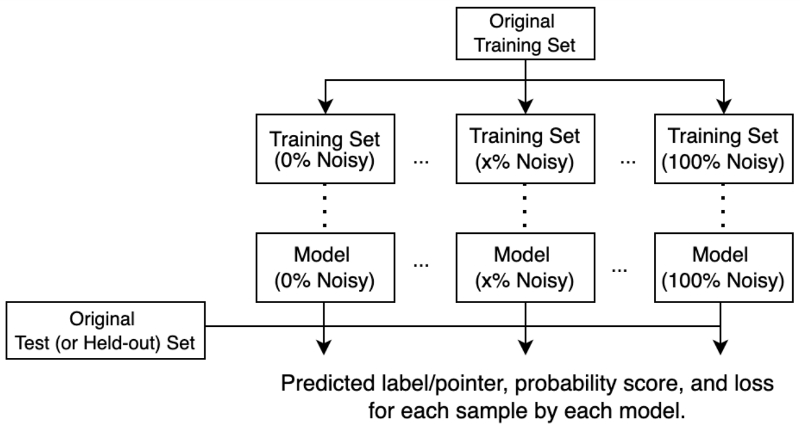

# CI - Memorization and Generalization

This repository contains the evaluation scripts and detailed results of our paper '[Memorization and Generalization in Neural Code Intelligence Models](https://arxiv.org/abs/2106.08704)' accepted at the [IST Journal, Elsevier 2022](https://www.journals.elsevier.com/information-and-software-technology).

---

## Structure

```
├── code/
    ├── noise_generation    # adding input/output noise to data
    ├── model_prediction    # logging predictions by models

├── data/
    ├── logs                # predictions on valid samples
    ├── summary             # summary results and plots
    
├── others/                 # other files
``` 

---

## Approach:

||
:-------------------------:
|Workflow for evaluating memorization and generalization of models.|

---

## Experimental Settings:

  * Method Name Prediction (MethodName):
    * Models: [code2vec](https://github.com/tech-srl/code2vec/) & [code2seq](https://github.com/tech-srl/code2seq/)
    * Dataset: [Java-Small, Java-Med, and Java-Large(Top10)](https://github.com/tech-srl/code2seq/#java)

  * Variable Misuse (VarMisuse):
    * Models: [Transformer, GGNN, and Great](https://github.com/VHellendoorn/ICLR20-Great/tree/master/models)
    * Dataset: [Py150](https://github.com/google-research-datasets/great)

  * Code-to-Text Generation (Code-to-Text):
    * Model: [CodeBERT](https://github.com/microsoft/CodeXGLUE/tree/main/Code-Text/code-to-text/code)
    * Dataset: [CodeSearchNet(cleaned)](https://github.com/microsoft/CodeXGLUE/tree/main/Code-Text/code-to-text#dataset)

  * Natural Language Code Search (CodeSearch):
    * Model: [CodeBERT](https://github.com/microsoft/CodeBERT/tree/master/CodeBERT/codesearch)
    * Dataset: [CodeSearchNet(preprocessed)](https://github.com/microsoft/CodeBERT/tree/master/CodeBERT/codesearch#data-preprocess)

---

Check the following repositories from @AftabHussain for the great variable misuse experiments:  
- https://github.com/AftabHussain/noise-gen_great-varmisuse  
- https://github.com/AftabHussain/save-trainstats_great-varmisuse  

---

## Citation:

[Memorization and Generalization in Neural Code Intelligence Models](https://doi.org/10.1016/j.infsof.2022.107066)

```
@article{rabin2023memorization,
  title = {Memorization and generalization in neural code intelligence models},
  author = {Md Rafiqul Islam Rabin and Aftab Hussain and Mohammad Amin Alipour and Vincent J. Hellendoorn},
  journal = {Information and Software Technology},
  volume = {153},
  pages = {107066},
  year = {2023},
  issn = {0950-5849},
  doi = {https://doi.org/10.1016/j.infsof.2022.107066},
  url = {https://www.sciencedirect.com/science/article/pii/S0950584922001756}
}
```
