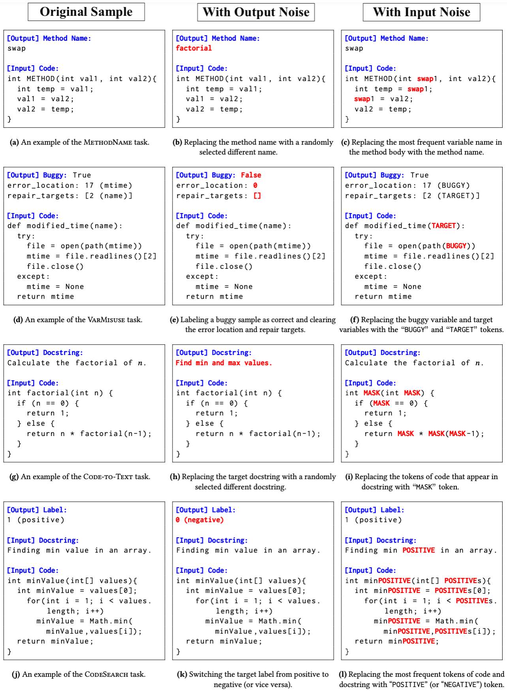

## Experimental Settings:

  * Method Name Prediction (MethodName):
    * Models: [code2vec](https://github.com/tech-srl/code2vec/) & [code2seq](https://github.com/tech-srl/code2seq/)
    * Dataset: [Java-Small, Java-Med, and Java-Large(Top10)](https://github.com/tech-srl/code2seq/#java)

  * Variable Misuse (VarMisuse):
    * Models: [Transformer, GGNN, and Great](https://github.com/VHellendoorn/ICLR20-Great/tree/master/models)
    * Dataset: [Py150](https://github.com/google-research-datasets/great)

  * Code-to-Text Generation (Code-to-Text):
    * Model: [CodeBERT](https://github.com/microsoft/CodeXGLUE/tree/main/Code-Text/code-to-text/code)
    * Dataset: [CodeSearchNet(cleaned)](https://github.com/microsoft/CodeXGLUE/tree/main/Code-Text/code-to-text#dataset)

  * Natural Language Code Search (CodeSearch):
    * Model: [CodeBERT](https://github.com/microsoft/CodeBERT/tree/master/CodeBERT/codesearch)
    * Dataset: [CodeSearchNet(preprocessed)](https://github.com/microsoft/CodeBERT/tree/master/CodeBERT/codesearch#data-preprocess)

---

## Example of Noisy Samples:

||
:-------------------------:
|Examples of original samples, output noise, and input noise for code.|
